  
  <!-- profile header: monochrome terminal session card -->

 

Building voice-first systems and full-stack applications where AI is part of the product, not just a demo.

  

---

## About

I take ideas from concept to deployment — architecting systems where speech-to-text, conversational models, and retrieval-augmented generation become production features rather than experiments. I care about building software people can actually use, not just demos that showcase capability.

Currently focused on voice AI pipelines, LLM integration, and full-stack applications that make AI accessible through clean UX.

## Featured Work

**[VAL.AI](https://github.com/mat-devx) — Voice-first AI journal**  
Speak naturally, get AI responses back, with retrieval over your own entries. End-to-end voice UX: Whisper STT → LLM processing → RAG → conversational interface.

**[OJT & Immersion Attendance System](https://github.com/mat-devx) — DOST**  
Production attendance platform serving 200+ students annually. Built the schema from scratch, implemented role-based access control, and automated reporting workflows that cut administrative time by ~30%.

**[BDocuLink](https://github.com/mat-devx/BDocuLink) — Barangay document management**  
Resident records and approval workflows moved from paper to structured software.

**[SmartVote](https://github.com/mat-devx/SmartVote) — Voting platform**  
Ballot construction, candidacy management, and result tabulation system.

## Stack

**Building with**

Voice & AI: `Whisper STT` · `ElevenLabs TTS` · `LLMs` · `RAG` · `Prompt Engineering`

Frontend: `React` · `Next.js` · `TypeScript` · `Tailwind CSS`

Backend: `Laravel` · `PHP` · `Supabase` · `MySQL`

Tools: `Git` · `Docker` · `GitHub Actions` · `Vercel`

**Experienced in**

Full-stack development across Next.js, Laravel, and Supabase ecosystems. Database schema design. Requirements gathering and translating stakeholder needs into working software. AI/ML fundamentals, data structures, software engineering principles.

## What Drives Me

> Don't just build demos. Build systems people can actually use.

The goal isn't to make a model respond — it's to build the complete system around it. That means understanding the problem space, designing clear interfaces, handling edge cases, and shipping software that solves real needs.

I believe AI should feel natural in the product, not bolted on. Voice interfaces should feel conversational. Data retrieval should feel instant. The technical complexity should be invisible to the user.

## Experience

**Software Developer — Department of Science and Technology (DOST)** · 2025–2026  
Built the annual OJT attendance system handling 200+ students. Designed the database schema, implemented role-based access control, and created automated reports. Learned: shipping production systems under real constraints, working directly with stakeholders, translating operations into software.

**Full-Stack Web App Developer — Philippine Ports Authority (PPA)** · 2025  
Automated records and workflow systems, replacing manual processes. Partnered with stakeholders to scope requirements and deliver working solutions.

**Education — BS Information Technology** · Diploma Medical Center College Foundation  
Coursework: Web Systems · Database Design · AI/ML Fundamentals · Software Engineering · Data Structures & Algorithms

## Currently

Working on voice AI systems and exploring better patterns for RAG in production applications. Building projects that demonstrate how AI can enhance real workflows without overwhelming the user experience.

Open to full-time roles (AI/software engineering), freelance projects, and collaborations on voice-first products. Remote or hybrid.

---

*Building useful software with intelligence at the core.*

