  

 

I'm an **AI Engineer and Full-Stack Developer** based in Dipolog City, Philippines. I build end-to-end web systems with a focus on voice AI — speech-to-text, conversational models, and retrieval-augmented generation — wired into production-shaped applications rather than demos.

- Built **VAL.AI**, a voice-first journal where you speak naturally and receive AI responses back
- Shipped a **Laravel/MySQL attendance platform** handling **200+ students per year** at DOST
- Cut administrative reporting time by **~30%** through automated report generation
- Deepening **LLM + RAG**, agents, and database design

**Open to work** — available for full-time roles, freelance projects, and long-term
collaborations. Based in Dipolog City, Philippines; open to remote and hybrid work.

 

<table>
  <tr>
    <td valign="top" width="260"></td>
    <td valign="top" width="555"></td>
  </tr>
</table>

 

 

## Stack

**AI & Voice**

**Frontend**

**Backend & Data**

**Tooling**

 

## Experience

**Software Developer — Department of Science and Technology (DOST)** · 2025–2026
- Built the annual OJT and immersion attendance system handling **200+ students per year** (Laravel, React, TypeScript, MySQL, Inertia.js, Tailwind CSS).
- Designed the database schema and **role-based access control**, plus automated reports that cut administrative reporting time by **~30%**.
- Ran requirements sessions with PPA stakeholders, translating manual port operations into working software specifications.

**Full-Stack Web App Developer — Philippine Ports Authority (PPA)** · 2025
- Automated records, application workflows and data management, replacing manual processing and reducing administrative workload for programme staff.
- Partnered with stakeholders to analyse requirements and scope deliverables.

**Education** — BS Information Technology, Diploma Medical Center College Foundation, Inc.
Coursework in Web Systems, Database Design, AI/ML Fundamentals, Software Engineering, and Data Structures & Algorithms.

 

## Contact

  
